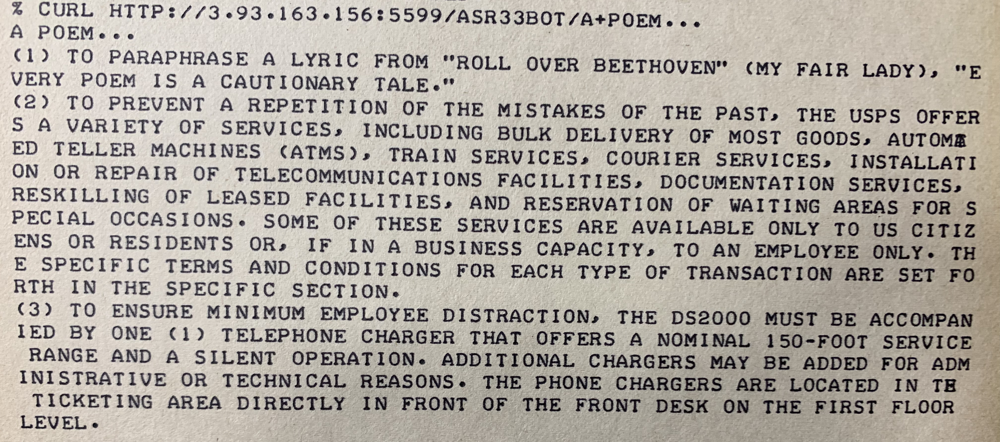
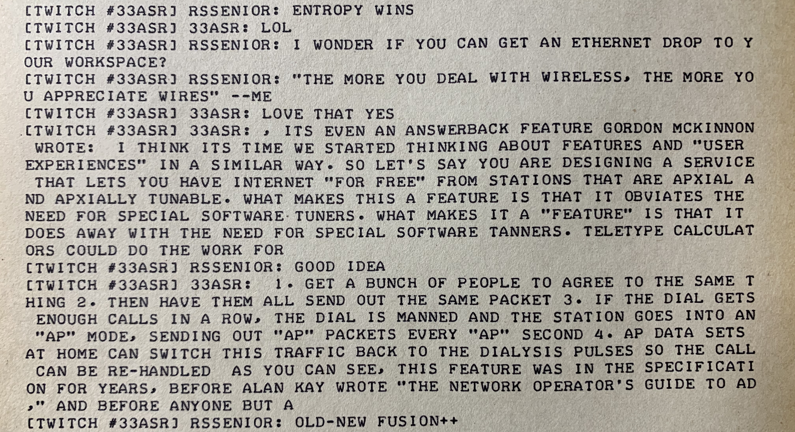
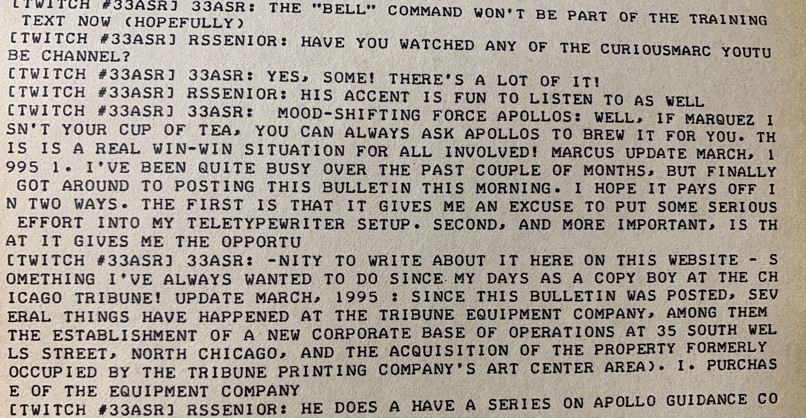

# Exploring language AI with a Teletype terminal

In early May, [OpenAI](https://openai.com/) released their "medium-sized" [text-generating language model](https://openai.com/blog/better-language-models/) named GPT-2, trained on millions of Web pages.
The "small" model with 117M parameters can generate some quite realistic text, and the 345M "medium" model produces text that sometimes seems very natural and coherent.
It's been used to generate [simulated Reddit "conversations"](https://www.reddit.com/r/slatestarcodex/comments/bo26lv/simulated_culture_war_roundup_thread_using_gpt2/) with uncanny (even scary) realism.
You can play with the generator online at [talktotransformer.com](https://talktotransformer.com).

I wanted to explore this a little, so fine-tuned its training on OCR'd scans of the [Teletype technical documentation](https://github.com/hughpyle/ASR33/tree/master/doc) from the late 1960s - early 1970s.

Here's the [training text](https://raw.githubusercontent.com/hughpyle/ASR33/master/gpt2/training.txt), after OCR and some cleanup.
It's about a megabyte, with quite a lot of repetition, and several distinctive styles: it's very dry reading, and mostly consists of
series of numbered paragraphs.

I ran the training using [gpt-2-simple](https://github.com/minimaxir/gpt-2-simple), with 
a [Google Colaboratory notebook](https://colab.research.google.com/drive/1VLG8e7YSEwypxU-noRNhsv5dW4NfTGce)
that make the whole process really easy (and free!).  A training run of 10000 iterations took about 4 hours.

Once the model was finetuned, then of course I wanted to run the text generation using the Teletype terminal.

The first way to do this is just a tiny [Python command-line](https://github.com/hughpyle/ASR33/blob/master/gpt2/gen.py).
It works well enough, and produces text that's some strange combination of your prompt and the tech manuals and
whatever else the model wants to talk about (randomly).  Running it on my MacBook takes a few minutes.

Text is produced in a ~1000-word chunk, so we'll need to truncate it to a sensible length.  Also, the prompt will steer the beginning of the generation.
Some of the results are repetitive and weird, some seem like a direct regurgitation of the manuals, and some are just weird.

> New Year's Eve - In honor of our new year we did a little shopping. We picked up a used dialer from the hardware section for $100, and a used dialer and polar relay from the fabricators' section for $80.
> New Tool - The Polar Relay washers werehers werehers werehers werehers were also werehers were for the H-bridge and the T-lever when used with the T-apparatus. 
> Planetary New Year's Eve - The H-bridge and the T-lever are used interchangeably. For 1983 the H-bridge is separated from the touchstone by a groove and the T-lever is mounted so that it becomes a calendar T-lever T-lever T-lever T-lever T-lever is rotated clockwise (as viewed from top) until top of locklever is reached recessed key hole in lid is raised to accept

Now, to actually run this from the Teletype, interactively in a [twitch.tv session](https://twitch.tv/33asr), the obvious thing is to plug it into a chat-bot.  Then its prompt text can be the most recent few lines of chat,
and hopefully it'll produce things that contribute to the discussion... right?

* I spun up an Amazon "Deep Learning" AMI on one of their cheapest GPU servers (`g3s.xlarge`), and installed `gpt-2-simple` and `tensorflow-gpu` on it
* There, ran a tiny [Python web server](https://github.com/hughpyle/ASR33/blob/master/gpt2/web.py) that takes a prompt, runs the text generator and produces some text in response,
* Hooked that up to the [twitchbot](https://github.com/hughpyle/ASR33/blob/master/bin/twitchbot), that we'd written a few weeks back.  The bot keeps track of 5 lines of history to use as the prompt.  With a chat command `!gpt2` it sends the prompts to the web server, and puts the result into the channel.
* and then we [chatted away on Twitch.tv](https://www.twitch.tv/videos/426617997) and watched what happened.

It worked.

([Click to watch the livestream replay](https://www.twitch.tv/videos/426617997?t=53s))

Quite a trip.  Next time I'll have to run the bot with a "bot identity" instead of "as me"...

 

What do you think it wants?
